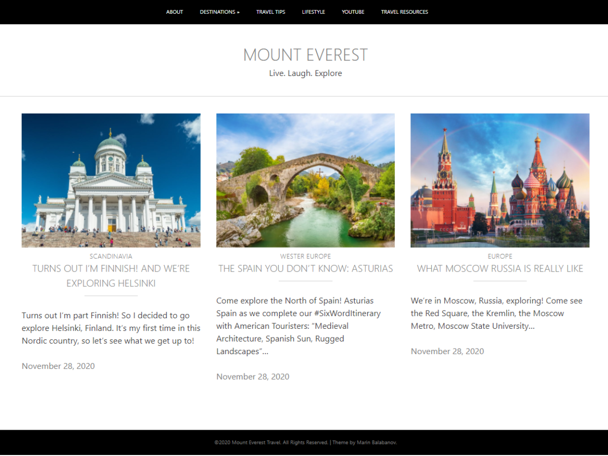
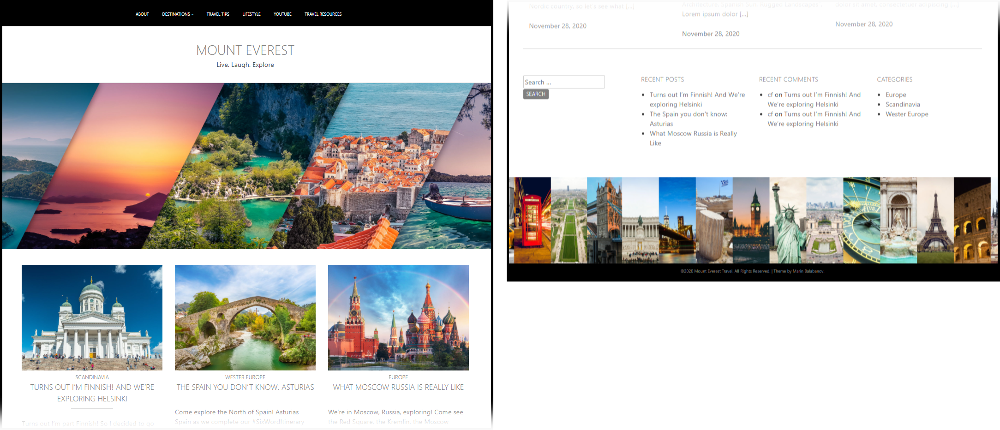
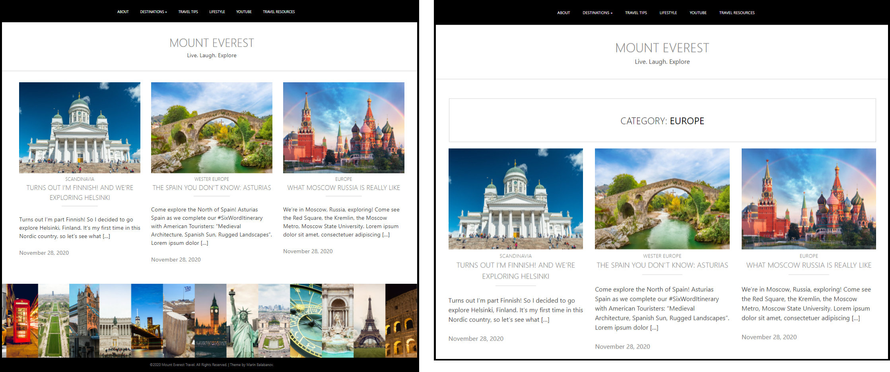
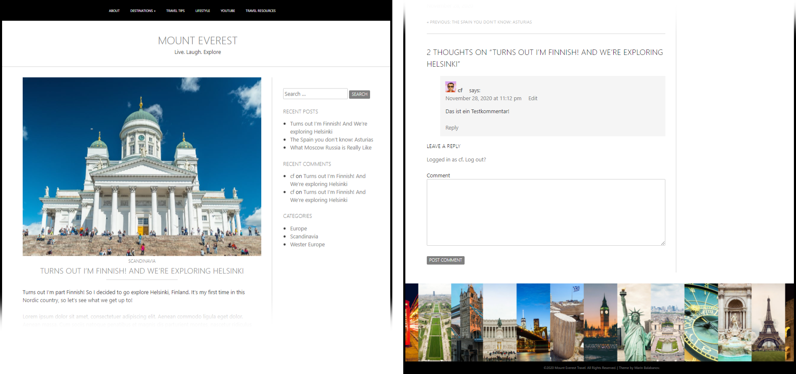
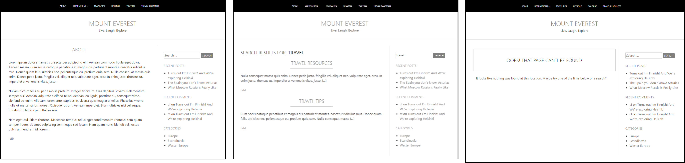

# Code Review 12

## Description
This is a __WordPress theme__ for a travel agency as an exercise for CodeFactory. The underlying structure is based on the model theme available on https://underscore.me You can find a working example of this theme here: http://ptstest.com/cr12/ 

The design is based on the requirements defined by CodeFactory in Code Review 12. The initial design was created using __Bootstrap__ and can be found here as flat HTML https://github.com/mbalabanov/CF-CR12-MarinBalabanov/tree/main/boostrap-model

<kbd></kbd>

The final theme does not use Bootstrap but nevertheless adheres to the requirements. This repository contains all of the adapted layout files. The actual custom CSS is in _styles-custom.css_.

## Installation
The whole theme is available as a __ZIP file__ here: https://github.com/mbalabanov/CF-CR12-MarinBalabanov/blob/main/CF-CR12-MarinBalabanov.zip
When you insert pages for the navigation menu, please set the menu to _primary_.

Download the ZIP file and uncompress it into the WordPress themes folder. Then select and activate the theme in the appearance menu.

## Structure
- __front-page.php:__ The custom front page overrides the _index.php_ for home. In its core it has the same grid of blog posts, but it also has a large header and the sidebar aligned horizontally beneath the grid. __(Example: http://ptstest.com/cr12/ )__

__Screenshot of Custom Frontpage (top and bottom sections)__

- __index.php:__ This is the site's main design. It can be used for the grid of blog posts.
- __archive.php:__ This has the same appearance as _index.php_ but includes the category title above the grid of blog posts. __(Example: http://ptstest.com/cr12/?cat=4 )__

__Screenshots of Index (left) and Archive Pages (right)__

- __single.php:__ This file defines the appearance and layout of individual blog posts. The main content area for the article is 70% wide, leaving 30% for the sidebar with the widgets. The area beneath the article is occupied by the comments and the form for new comments. It includes _template-parts/content.php_ and _comments.php_ __(Example: http://ptstest.com/cr12/?p=13 )__

__Screenshot of Single Post (top and bottom sections)__

- __page.php:__ This is the template used for pages that are not blog posts. It is adapted from _single.php_.  It includes _template-parts/content-page.php_ __(Example: http://ptstest.com/cr12/?page_id=22 )__
- __search.php__ and __404.php:__ These two administrative pages have a similar design to _single.php_. The search page uses includes _template-parts/content-search.php_ __(Examples: Search Results http://ptstest.com/cr12/?s= and 404 Page http://ptstest.com/cr12/?page_id=23 )__

__Screenshot of Page (left), Search (center) and 404 (right)__

- __/template-parts__, __/inc__ and __/js:__ These directories include the PHP components that are included on other pages. The _/js_ directory provides the functionality for the naviation.
- __/sass:__ This directory contains all the original SASS files from the underscore.me theme. They were compiled into _style.css_. The additional styles in this theme are defined in _styles-custom.css_.
- __UNDERSCORES-README.md:__ This is the original readme file provided by underscore.me.
